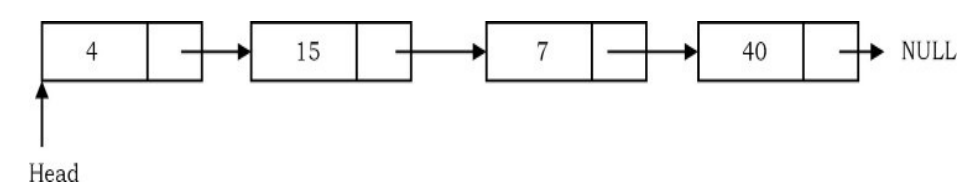

## Data Structures and Algorithms Java

### Linked Lists

#### What is a Linked List?

A Linked list is a data structure used for storing collection of data. A linked list has the following
properties.

    * Note:- A linked list is a linear data structure that consists of a series of nodes connected 
                by pointers (in C or C++) or references (in Java, Python and JavaScript). Each node contains data and 
                a pointer/reference to the next node in the list. Unlike arrays, linked lists allow for efficient insertion or removal 
                of elements from any position in the list, as the nodes are not stored contiguously in memory. 

* Successive element are connected by pointers
* The last element points to NULL
* Can grow or shrink in size during execution of a program
* Can be make just as long as required (until system memory exhausts)
* Does not waste memory space (but takes some extra memory for pointers). It
  allocates memory as list grows.

#### Linked List ADT

The following operations make linked list an ADT:

#### Main Linked List Operations

    • Insert: insert an element into the list
    • Delete: removes and returns the specified position element from the list.    

#### Auxiliary Linked List Operations

    • Delete List: removes all elements of the list (disposees the list)
    • Count: returns the number of elements in the list
    • Find nth node from the end of the list

### Why Linked List?

There are many other data structures that do the same thing as linked lists. Before discussing
linked lists it is important to understand the difference between linked lists and arrays. Both
linked lists and arrays are used to store collections of data, and since both are used for the same
purpose, we need to differentiate their usage. That means in which cases arrays are suitable and
in which cases linked lists are suitable.

#### Advantages of Linked Lists
Linked lists have both advantages and disadvantages. The advantage of linked lists is that they can
be expanded in constant time. To create an array, we must allocate memory for a certain number
of elements. To add more elements to the array when full, we must create a new array and copy
the old array into the new array. This can take a lot of time.
We can prevent this by allocating lots of space initially but then we might allocate more than we
need and waste memory. With a linked list, we can start with space for just one allocated element
and add on new elements easily without the need to do any copying and reallocating.

### Singly Linked Lists

  Basic Operations on a List
  • Traversing the list
  • Inserting an item in the list
  • Deleting an item from the list

### Singly Linked List Insertion
