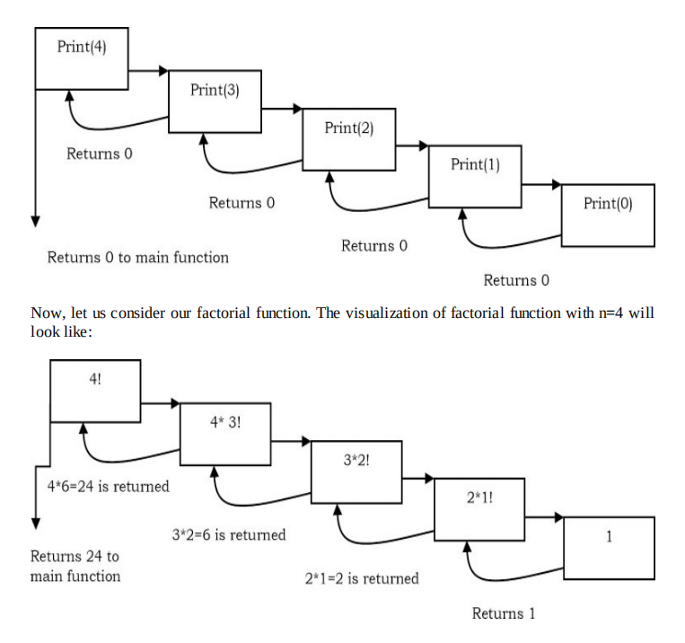

## Data Structures and Algorithms Java

### Recursion and Backtracking

### What is recursion?

Any function which calls itself is called recursive. A recursive method solves a problem
by calling a copy of itself to work on a smaller problem. This is called the recursive
step. The recursion step can result in many more such recursive calls. It is important to
ensure that the recursion terminates. Each time the function calls itself with a slightly
simpler version of the original problem. The sequence of smaller problems must eventually
converge on the base case.

<br>

#### Que: Calculate factorial of a positive integer.

```
Using Recursive
int n = 5;
n! = 5 * 4 * 3 * 2 * 1;

factorial of 5! = 120
```

### Recursion and Memory (Visualization)

Each recursive call makes a new copy of that method (actually only the variable) in memory.
Once a method ends (that is, returns some data), the copy of that returning method is removed from memory. The
recursive solution look simple but visualization and tracing takes time. For
better understanding, let us consider the following example.

Example:-

Print Value of n
int n = 5;

```
public int print(int n){
if(n==0){       // This is terminating base case
    return 0;
}else{
    System.out.println(n);
    return print(n-1);  // recursive call to itself again
}
}
```

For this example, if we call the print function with n=4, visually our memory assignments may
look like:



### Fibonacci Series

```
Using Recursive
int a = 0;
int b = 1;
int n = 7
fib = 0 1 1 2 3 5 8 13;
```

### Tower Of Hanoi - Using Recursion

```
Using Recursive
int n = 3;
char fromRod = 'A';
char toRod = 'C';
char auxRod = 'B';
```

### Check whether the array is in sorted order.
#### Using Iterative approach
```
int n = 6;
int[] a = new int[]{3, 6, 4, 7, 8, 9};
```